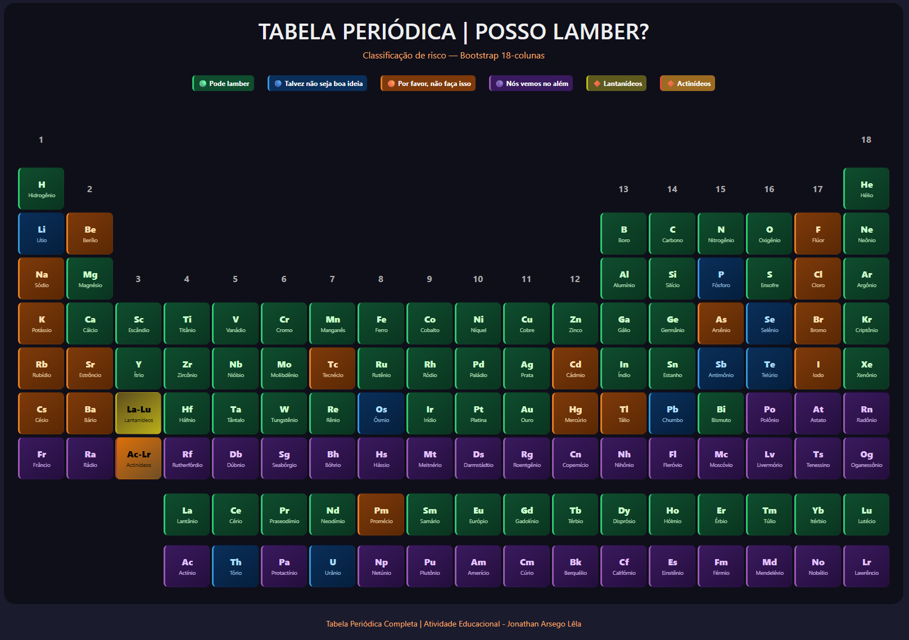
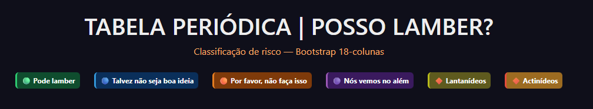
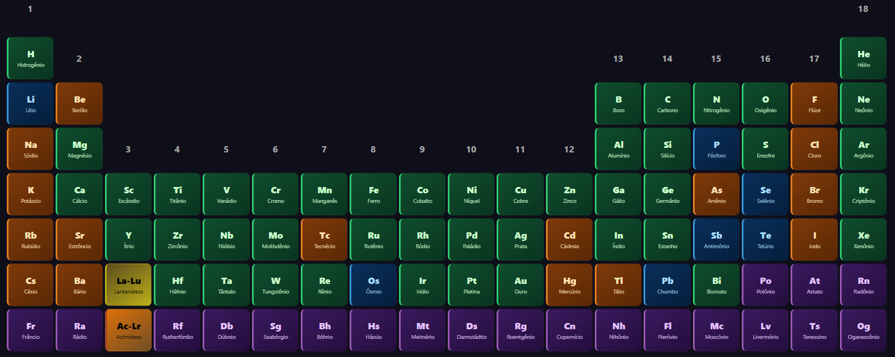
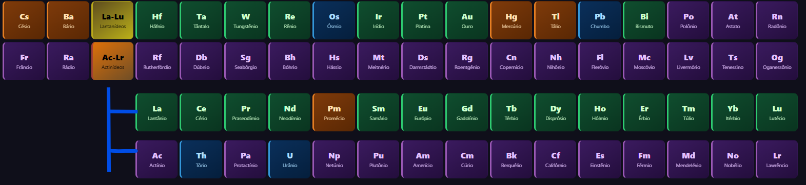

# Tabela Periódica Completa – Posso Lamber?


Uma tabela periódica interativa e totalmente funcional, desenvolvida com **Bootstrap 5** e estendida para suportar **18 colunas** – algo que o grid nativo do framework não oferece. Cada elemento químico é apresentado com sua sigla e nome completo, além de uma classificação por cores baseada em um critério lúdico: o “risco de lamber”. O projeto foi criado como atividade acadêmica para a disciplina de Desenvolvimento Web, com foco na aplicação correta das classes do Bootstrap, na estruturação por linhas (rows) e na justificativa técnica para extensões CSS customizadas.

## Screenshots

### Visão geral da tabela periódica


### Legenda e primeiros períodos


### Detalhe das 18 colunas e células vazias


### Linha dos lantanídeos e actinídeos


## Sobre o Projeto

O projeto consiste em uma **tabela periódica completa** (118 elementos) organizada visualmente por meio do sistema de grid do Bootstrap. Diferente de uma tabela HTML convencional, a estrutura foi construída utilizando **múltiplas linhas (`.row`)** – uma para cada período químico – e, dentro de cada linha, **18 colunas (`.col`)** que representam os grupos da tabela. Onde não há elemento, foram inseridas **células vazias** (com `visibility: hidden`) para preservar o alinhamento.

Como o Bootstrap suporta apenas 12 colunas nativamente, foi necessária uma **extensão CSS customizada**: a classe `.row-cols-18` força cada coluna a ter largura de `5.55555556%` (100% / 18), mantendo o comportamento flexível do framework. Essa solução é documentada no relatório e plenamente justificável para atender aos requisitos da atividade.

A classificação por cores segue um critério lúdico de “risco de lamber”, dividido em quatro categorias:
- **Verde** – pode lamber (elementos inertes ou seguros)
- **Azul** – talvez não seja uma boa ideia (toxicidade moderada)
- **Laranja** – por favor, não faça isso (reativos / tóxicos)
- **Roxo** – nós vemos na outra vida (radioativos / extremamente perigosos)

Além disso, lantanídeos e actinídeos recebem gradientes específicos para facilitar a identificação visual das séries internas.

## Tecnologias Utilizadas

- **HTML5** – estrutura semântica com `div`s aninhadas representando `row` e `col`, títulos, legendas e rodapé.
- **CSS3** – variáveis de cores, gradientes lineares, efeitos de hover, regras de responsividade.
- **Bootstrap 5.3.0** – classes `row`, `col`, `g-1`, `text-center`, `d-flex`, `justify-content-center`, `flex-wrap`, `badge`.
- **Extensão CSS customizada** – `.row-cols-18` para suporte a 18 colunas.

## Funcionalidades

- **Grid de 18 colunas** – cada elemento posicionado exatamente no grupo correto, com células vazias preenchendo os espaços.
- **Classificação por cores** – quatro níveis de “perigo de lamber” mais as séries lantanídeos/actinídeos.
- **Legenda interativa** – badges coloridas explicando o significado de cada categoria.
- **Efeito hover nas células** – zoom suave (`scale(1.05)`) e sombra ao passar o mouse.
- **Gradientes personalizados** – cada categoria possui um gradiente linear e uma borda lateral colorida.
- **Responsividade parcial** – em telas muito estreitas, a tabela exige rolagem horizontal.
- **Células vazias invisíveis** – utilizam `visibility: hidden` para manter o layout sem exibir conteúdo indesejado.

## Detalhes Visuais

O projeto adota uma estética escura com fundo `#1b1b2e` e container centralizado com bordas arredondadas, proporcionando contraste e legibilidade.

- **Células de elementos**: fundo `#1e1e2a`, bordas arredondadas, padding reduzido, `display: flex` com direção vertical.
- **Categorias**:
  - Verde: gradiente `#0f4d2e` → `#0a3520`, borda esquerda `#2ecc71`
  - Azul: gradiente `#0a2f5a` → `#051f3d`, borda esquerda `#3498db`
  - Laranja: gradiente `#7e3a0a` → `#5a2804`, borda esquerda `#e67e22`
  - Roxo: gradiente `#3a1a5e` → `#240e3d`, borda esquerda `#9b59b6`
  - Lantanídeos: gradiente amarelado
  - Actinídeos: gradiente alaranjado escuro
- **Células vazias**: fundo transparente, borda tracejada e conteúdo invisível.
- **Rodapé**: texto pequeno com cor alaranjada e centralização.

## Como Executar

1. Clone o repositório:
```bash
git clone https://github.com/FaculdadeJV/Tabela_periodica.git


